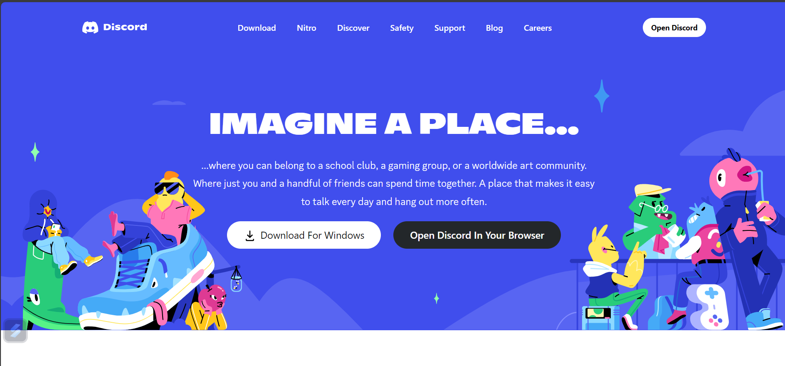

# Discord Clone - Frontend

WEBSITE LIVE BUT IN DESKTOP VERSION :- (https://discordclonebyadityadwivedi.netlify.app/)

## Overview
This repository contains the frontend implementation of a Discord clone, developed as a project to showcase HTML, CSS, Tailwind and javascript skills. The project focuses on replicating the user interface of the popular community platform Discord.

## Features
- Responsive design coming soon.
- Home page showcasing product categories and featured items
- Product listing pages with dynamic content loading
- Product details page with additional information
- Interactive elements such as image sliders and hover effects
- Basic shopping cart functionality

## Technologies Used
- HTML5
- CSS3
- Tailwind Css

## Contributing
If you'd like to contribute or have suggestions, feel free to create an issue or submit a pull request.

## License
This project is licensed under the MIT License - see the [LICENSE](LICENSE) file for details.

